# Dense-Evolution — Architecture Map

Generated by scanning the real package tree (`find dense_evolution -name "*.py"`), not
from memory — kept here so an agent (Claude Code, another CLI agent, or an MCP client)
can orient itself without re-scanning the whole codebase every session. Update this file
whenever a module is added, moved, or promoted from Dense-Evolution-Discovery.

## How to read this

`dense_evolution/` has **two layers**:

1. **Real subpackages** (`backends/`, `circuits/`, `physics/`, `mitigation/`, `solvers/`,
   `interop/`, `utils/`, `noise/`, `native_hf/`) — where the actual code lives.
2. **22 flat backward-compatibility shims** at the top level (`fermions.py`,
   `observables.py`, `chunk.py`, `healing.py`, ...) — each one re-exports from its real
   subpackage home (e.g. `dense_evolution/fermions.py` → `dense_evolution.physics.fermions`)
   so old `from dense_evolution.fermions import ...`-style imports (used by external
   consumers like Dense-Evolution-Discovery) keep working. **Never edit a shim's logic —
   only its target subpackage.** They exist purely for import-path stability.

The public API (what `import dense_evolution as de; de.X` actually exposes) is assembled
in `dense_evolution/__init__.py`'s `__all__` — that file is the single source of truth for
"is X part of the public API", not any individual subpackage's own `__all__`.

```mermaid
graph TD
    ROOT["dense_evolution/__init__.py<br/>(public API surface, __all__)"]

    subgraph CORE["1. Core Functionality &amp; Simulators"]
        BACKENDS["backends/"]
        SV["statevector.py<br/>DenseSVSimulator"]
        MPSB["mps.py<br/>MPSSimulator"]
        CHUNK["chunk/ (subpackage)<br/>core, kernels, disk_overflow,<br/>circuit_chunker, geometry, guard"]
        CIRCUITS["circuits/"]
        PARSER["parser.py — QASMParser"]
        COMPILER["compiler.py — QuantumTranspiler"]
        GATES["gates.py — GATES/PARAMETRIC_GATES/GATE_IDS"]
        REGISTRY["registry.py — QuantumHardwareRegistry, NoiseModel wiring"]
        DIAGRAM["diagram.py — plot_circuit"]
        TOPOLOGY["topology.py — entangling_layer"]
        TROTTER["trotter.py — pauli_rotation_ops, trotter_evolve_ops"]
        UCCSD["uccsd.py — find_excitations"]
        QFT["qft.py"]
        RANDCIRC["random_circuit.py"]
        CONFIG["config.py — set_precision"]

        BACKENDS --> SV
        BACKENDS --> MPSB
        BACKENDS --> CHUNK
        CIRCUITS --> PARSER
        CIRCUITS --> COMPILER
        CIRCUITS --> GATES
        CIRCUITS --> REGISTRY
        CIRCUITS --> DIAGRAM
        CIRCUITS --> TOPOLOGY
        CIRCUITS --> TROTTER
        CIRCUITS --> UCCSD
        CIRCUITS --> QFT
        CIRCUITS --> RANDCIRC
    end

    subgraph SCI["2. Scientific Modules &amp; Algorithms"]
        PHYSICS["physics/"]
        POBS["observables.py<br/>pauli_expectation, pauli_hamiltonian_to_matrix,<br/>multiply_pauli_terms"]
        PENT["entropy.py<br/>partial_trace, von_neumann_entropy, mutual_information"]
        PFERM["fermions.py<br/>majorana_pauli_terms, total_parity_operator (Klein factor)"]
        PQEC["qec.py<br/>Steane/stabilizer decoding, erasure correction"]
        PSTATES["states.py — ghz_state"]
        SOLVERS["solvers/"]
        AUTODIFF["autodiff.py — circuit_to_energy_fn (VQE)"]
        HTB["harrison_tb.py — tight-binding Hamiltonians"]
        VHDTB["vhd_tb.py — VHD tight-binding, band structure"]
        NATIVEHF["native_hf/ (subpackage)<br/>gaussians, boys, overlap, kinetic, coulomb,<br/>assembly, scf, bridge, cartesian, basis<br/>(from-scratch Hartree-Fock)"]

        PHYSICS --> POBS
        PHYSICS --> PENT
        PHYSICS --> PFERM
        PHYSICS --> PQEC
        PHYSICS --> PSTATES
        SOLVERS --> AUTODIFF
        SOLVERS --> HTB
        SOLVERS --> VHDTB
    end

    subgraph MIT["3. Error Mitigation &amp; Noise Models"]
        NOISE["noise/"]
        KRAUS["kraus/ (subpackage)<br/>depolarizing, bitflip, phaseflip,<br/>amplitude_damping, combined, ideal"]
        DMCHAN["density_matrix_channels.py"]
        COSMIC["cosmic_ray.py — cosmic_ray_burst_profile"]
        OSC["oscillating.py — oscillating_p_eff"]
        DIFFNOISE["differentiable.py"]
        COHATT["coherent_attack.py"]
        MITIGATION["mitigation/"]
        ZNE["zne.py<br/>richardson/polynomial/bounded_exponential_extrapolate,<br/>zne_density_matrix, uhlmann_fidelity, project_to_physical"]
        MHEAL["healing.py — calculate_phi_ab, vettore_dinamico, delta_preemp"]
        RENYI["renyi.py — sandwiched_renyi_divergence (2-state divergence)"]
        MAGIC["magic_entropy.py — single-qubit Key-Unitary magic"]
        MAGICSH["magic_entropy_shadows.py — shadow-based estimator"]
        SRE["stabilizer_renyi_entropy.py — multi-qubit SRE magic monotone"]
        KL["kl_divergence.py — classical KL over probability vectors"]

        NOISE --> KRAUS
        NOISE --> DMCHAN
        NOISE --> COSMIC
        NOISE --> OSC
        NOISE --> DIFFNOISE
        NOISE --> COHATT
        MITIGATION --> ZNE
        MITIGATION --> MHEAL
        MITIGATION --> RENYI
        MITIGATION --> MAGIC
        MITIGATION --> MAGICSH
        MITIGATION --> SRE
        MITIGATION --> KL
    end

    subgraph IFACE["4. Interfaces, API &amp; Export Tools"]
        INTEROP["interop/"]
        QISPEN["qiskit_pennylane.py<br/>from_qiskit, from_pennylane, to_stim,<br/>run_qiskit_circuit, run_pennylane_circuit"]
        UTILS["utils/"]
        DRAW["drawing.py — draw_circuit"]
        MEAS["measurement.py — sample_counts, statevector_fidelity"]
        CLI["cli.py — dense-evolution console script"]
        SHIMS["22 top-level shim .py files<br/>(fermions.py, observables.py, chunk.py, healing.py,<br/>mps.py, parser.py, qec.py, states.py, ...)<br/>-- re-export only, no logic"]

        INTEROP --> QISPEN
        UTILS --> DRAW
        UTILS --> MEAS
    end

    ROOT --> CORE
    ROOT --> SCI
    ROOT --> MIT
    ROOT --> IFACE
    SHIMS -.->|"re-exports from"| PHYSICS
    SHIMS -.->|"re-exports from"| BACKENDS
    SHIMS -.->|"re-exports from"| CIRCUITS
    SHIMS -.->|"re-exports from"| MITIGATION
```



## Notable cross-package facts (verified, not assumed)

- **`dense_evolution.chunk`** (`backends/chunk/`) is deliberately also bound as a package
  attribute in the top-level `__init__.py` via `from . import chunk as chunk`, so external
  code can do `de.chunk.SafeMemoryGuard()` (attribute access) even though nothing imports
  a name *from* `dense_evolution.chunk` at the top level.
- **Klein factor / `total_parity_operator`** (`physics/fermions.py`) depends on
  **`multiply_pauli_terms`** (`physics/observables.py`) — a real, one-directional
  dependency (`fermions.py` imports from `observables.py`, never the reverse).
- **`stabilizer_renyi_entropy`** (multi-qubit, per-state) and **`magic_entropy`**
  (single-qubit, Key-Unitary) are BOTH in `mitigation/` but are unrelated constructions —
  do not conflate them when navigating this map or answering a question about "magic".
- **`sandwiched_renyi_divergence`** (2-density-matrix divergence) is also unrelated to
  both magic quantities above, despite living in the same `mitigation/` subpackage and
  sharing the word "Renyi".
- Most of `mitigation/`, `physics/fermions.py`, and `physics/observables.py`'s newer
  functions were **promoted from Dense-Evolution-Discovery** (the research/experiments
  repo) after being validated there first — see each module's own docstring for the
  originating experiment/paper.

## Real dependency contracts (not the same as the package grouping above)

The `graph TD` above shows package *membership*, not *who actually imports whom*. The
real cross-subpackage import edges (from `grep -rn "^from \.\.\|^from dense_evolution\."`
across every module, not guessed):

```text
backends/statevector.py  -> circuits/{registry,gates,compiler}, config
circuits/registry.py     -> config, noise/ (NoiseModel, NoiseSpec)
physics/states.py        -> circuits/topology
mitigation/zne.py        -> noise/ (global_depolarizing_channel, amplitude_damping_channel, cosmic_ray_burst_profile)
solvers/autodiff.py      -> circuits/{parser,gates,compiler,registry}, config
interop/qiskit_pennylane -> circuits/parser, backends/statevector
noise/coherent_attack.py -> physics/qec (compute_syndrome)
native_hf/*               fully self-contained internal DAG (basis -> gaussians/overlap;
                           assembly -> basis/cartesian/gaussians/overlap/kinetic/coulomb;
                           bridge -> basis/assembly/scf), touches the rest of the package
                           only via PennyLane's own qml.Hamiltonian return type
```

Two facts worth being explicit about, since they contradict what the package-grouping
diagram alone would suggest:

- **`solvers/autodiff.py` imports nothing from `backends/` or `physics/`.** The Hamiltonian
  it needs (`h_matrix`) is supplied by the *caller* — a dense matrix from
  `physics/observables.py`, or a [`PauliSumOperator`](https://tatopenn-cell.github.io/Dense-Evolution/api/observables/)
  — never imported internally. `circuit_to_energy_fn` only depends on `circuits/` (to
  parse/transpile/compile the ansatz) and `config` (to enable `x64`).
- **`circuits/compiler.py`'s `_compile_and_run_circuit_jit` is the one shared execution
  kernel** both `DenseSVSimulator.run_circuit_jit` (`backends/statevector.py`) and
  `circuit_to_energy_fn`'s `energy_fn` (`solvers/autodiff.py`) call — not two independent
  reimplementations of "run a circuit." A correctness fix or performance change there
  affects both the plain simulator path and the differentiable-VQE path identically.
- **`physics/observables.py`, `physics/entropy.py`, `physics/fermions.py`, `physics/qec.py`
  have zero dependency on `backends/` or `circuits/`** (the one exception,
  `noise/coherent_attack.py -> physics/qec.py`, runs the other direction). They're pure
  array-in/array-out math — a bare statevector or density matrix, never a simulator
  instance — which is what lets [`PauliSumOperator`](https://tatopenn-cell.github.io/Dense-Evolution/api/observables/)
  drop into `circuit_to_energy_fn`'s `h_matrix` slot with no simulator-side change needed.

## End-to-end execution flow

```text
QASM string
    |
    v
QASMParser().parse(...)  -->  QASMCircuit
    |
    v
QuantumTranspiler  (decomposes ccx/swap/etc. into this package's native gate set)
    |
    +-- eager path (DenseSVSimulator.run_circuit) --------- one Python call per gate
    |
    +-- jit path (both of the below build a (n_ops, 4) float64 template array,
    |             [g_id, q1, q2, param], then hand it to the SAME shared kernel):
    |       DenseSVSimulator.run_circuit_jit  ---------\
    |       circuit_to_energy_fn's energy_fn  ----------+-->  circuits/compiler.py
    |                                                          _compile_and_run_circuit_jit
    |                                                          (jax.lax.scan over ops,
    |                                                           one @jax.jit XLA call)
    v
statevector (2**n_qubits complex128, or complex64 -- see Design invariants)
    |
    +--> physics/observables.py, physics/entropy.py, utils/measurement.py
    |    (pauli_expectation, partial_trace, sample_counts, ... -- pure functions,
    |     no further dependency on how the statevector was produced)
    |
    +--> h_matrix @ statevector  (solvers/autodiff.py, only inside circuit_to_energy_fn)
             |
             v
         energy  --jax.grad-->  d(energy)/d(theta)  -->  optimizer step (e.g. optax.adam)
```

The static/dynamic split that matters for JAX tracing: `n_qubits`, the transpiled gate
*sequence* (which gates, which qubits, in what order), and `n_params` are all static —
fixed once `circuit_to_energy_fn(circuit, n_qubits)` is called, baked into the traced
graph. Only `theta` (and, when given, `noise.p`/`noise.jax_key`) are dynamic — the
values `jax.grad`/`jax.jit` actually trace through.

## Memory model

- **`DenseSVSimulator`**: one dense statevector, `O(2**n_qubits)` complex128 entries —
  16MB at 20 qubits, ~4GB at 28 qubits (`QuantumHardwareRegistry`'s own top
  `max_dense_qubits` tier, at `ram_total >= 50` GB) — the practical ceiling on a single
  machine, not this simulator's fault: no dense-statevector method anywhere can do
  better.
- **`MPSSimulator`**: `n_qubits` tensors of shape roughly `(chi, 2, chi)`, `O(n_qubits *
  max_bond**2)` — bounded, not exponential, at the cost of a bond-dimension truncation
  (adaptive, JSD-budget-driven — see the class docstring) that is exact only up to that
  truncation, not a free lunch.
- **`Chunk`**: splits a `2**n_qubits` statevector into `N_chunks` pieces of `O(2**k)`
  each (`k = n_qubits - log2(N_chunks)`), across multiple devices or, past device memory,
  disk (`disk_overflow`) — governed by `SafeMemoryGuard`, which refuses an allocation
  outright below a configured available-memory threshold rather than letting the OS
  start swapping. `QuantumHardwareRegistry.max_dense_qubits` (see `circuits/registry.py`)
  is a *suggested* ceiling from this machine's own RAM (three fixed tiers), not an
  enforced one — `Chunk`/`SafeMemoryGuard` is the actual enforcement mechanism.

Note that Pauli-sum-based Hamiltonians (`PauliSumOperator`, `pauli_sum_matvec`) are a
separate, orthogonal memory axis from all three of the above: they avoid the `O(4**n)`
*Hamiltonian matrix* `pauli_hamiltonian_to_matrix` would otherwise require — 4GB already
at 14 qubits — independent of which statevector backend is in use.

## Design invariants

- **Qubit 0 is the most significant bit** of every basis-state index, throughout —
  `backends/statevector.py`, `physics/observables.py`, `physics/entropy.py`,
  `physics/fermions.py`, `backends/chunk/` all share this convention. The one prior
  exception in the codebase (`dashboard_core/state_visuals.py`'s private, single-qubit-
  only `_reduced_density_matrix`, little-endian) is exactly why `physics/entropy.py`
  documents this explicitly rather than assuming a caller already knows.
- **`complex128` is the default scientific precision, enabled lazily.** `jax_enable_x64`
  is a process-wide JAX flag — `dense_evolution/config.py`'s `ensure_x64()` turns it on
  the first time `DenseSVSimulator`, `QuantumHardwareRegistry`, or `circuit_to_energy_fn`
  is constructed/called, never at import time (so `import dense_evolution` alone never
  silently overrides a precision a caller configured for unrelated JAX code already
  running). `physics/observables.py`'s `_jax`-suffixed functions
  (`pauli_sum_matvec_jax`, `pauli_sum_expectation_jax`, `PauliSumOperator`) are pure math
  with no opinion on global JAX state — call `set_precision(True)` yourself first if
  using them standalone, before anything else has a chance to enable `x64` (verified
  directly: skipping this gives `~1e-7` relative accuracy instead of `~1e-16`, no error).
- **Compatibility shims contain zero logic** — re-export only, never edited directly
  (see "How to read this" above).
- **The `theta -> energy(theta)` path must stay differentiable end to end.** Any
  operation on a traced value that forces concretization (`float()`, `np.asarray()`,
  a Python-level `if` branching on a traced value's truth) silently breaks `jax.grad` —
  this is exactly why `pauli_sum_matvec`/`pauli_sum_expectation` (numpy-based) needed
  `_jax` counterparts rather than being used directly inside `circuit_to_energy_fn`.
- **Scientific safety: raise, never silently degrade.** An unsupported gate in
  `circuit_to_energy_fn`'s template builder raises `ValueError` naming the gate rather
  than being silently dropped from the traced circuit; `physics/qec.py`'s decoders
  return `None` on an ambiguous syndrome rather than guessing. A wrong-but-plausible
  number is worse than a loud failure in a scientific simulator.

## Maintenance

Regenerate the `graph TD` block above (not by hand — re-run `find dense_evolution -name
"*.py"` and re-derive) whenever:
- A new subpackage is added under `dense_evolution/`.
- A function is promoted from Dense-Evolution-Discovery into an existing subpackage.
- A top-level shim is added or removed.

Do not let this file silently drift from the real tree — an agent trusting a stale map is
worse than one that re-scans.
