# Dense-Evolution — Architecture Map

Generated by scanning the real package tree (`find dense_evolution -name "*.py"`), not
from memory — kept here so an agent (Claude Code, another CLI agent, or an MCP client)
can orient itself without re-scanning the whole codebase every session. Update this file
whenever a module is added, moved, or promoted from Dense-Evolution-Discovery.

## How to read this

`dense_evolution/` has **two layers**:

1. **Real subpackages** (`backends/`, `circuits/`, `physics/`, `mitigation/`, `solvers/`,
   `interop/`, `utils/`, `noise/`, `native_hf/`) — where the actual code lives.
2. **22 flat backward-compatibility shims** at the top level (`fermions.py`,
   `observables.py`, `chunk.py`, `healing.py`, ...) — each one re-exports from its real
   subpackage home (e.g. `dense_evolution/fermions.py` → `dense_evolution.physics.fermions`)
   so old `from dense_evolution.fermions import ...`-style imports (used by external
   consumers like Dense-Evolution-Discovery) keep working. **Never edit a shim's logic —
   only its target subpackage.** They exist purely for import-path stability.

The public API (what `import dense_evolution as de; de.X` actually exposes) is assembled
in `dense_evolution/__init__.py`'s `__all__` — that file is the single source of truth for
"is X part of the public API", not any individual subpackage's own `__all__`.

```mermaid
graph TD
    ROOT["dense_evolution/__init__.py<br/>(public API surface, __all__)"]

    subgraph CORE["1. Core Functionality &amp; Simulators"]
        BACKENDS["backends/"]
        SV["statevector.py<br/>DenseSVSimulator"]
        MPSB["mps.py<br/>MPSSimulator"]
        CHUNK["chunk/ (subpackage)<br/>core, kernels, disk_overflow,<br/>circuit_chunker, geometry, guard"]
        CIRCUITS["circuits/"]
        PARSER["parser.py — QASMParser"]
        COMPILER["compiler.py — QuantumTranspiler"]
        GATES["gates.py — GATES/PARAMETRIC_GATES/GATE_IDS"]
        REGISTRY["registry.py — QuantumHardwareRegistry, NoiseModel wiring"]
        DIAGRAM["diagram.py — plot_circuit"]
        TOPOLOGY["topology.py — entangling_layer"]
        TROTTER["trotter.py — pauli_rotation_ops, trotter_evolve_ops"]
        UCCSD["uccsd.py — find_excitations"]
        QFT["qft.py"]
        RANDCIRC["random_circuit.py"]
        CONFIG["config.py — set_precision"]

        BACKENDS --> SV
        BACKENDS --> MPSB
        BACKENDS --> CHUNK
        CIRCUITS --> PARSER
        CIRCUITS --> COMPILER
        CIRCUITS --> GATES
        CIRCUITS --> REGISTRY
        CIRCUITS --> DIAGRAM
        CIRCUITS --> TOPOLOGY
        CIRCUITS --> TROTTER
        CIRCUITS --> UCCSD
        CIRCUITS --> QFT
        CIRCUITS --> RANDCIRC
    end

    subgraph SCI["2. Scientific Modules &amp; Algorithms"]
        PHYSICS["physics/"]
        POBS["observables.py<br/>pauli_expectation, pauli_hamiltonian_to_matrix,<br/>multiply_pauli_terms"]
        PENT["entropy.py<br/>partial_trace, von_neumann_entropy, mutual_information"]
        PFERM["fermions.py<br/>majorana_pauli_terms, total_parity_operator (Klein factor)"]
        PQEC["qec.py<br/>Steane/stabilizer decoding, erasure correction"]
        PSTATES["states.py — ghz_state"]
        SOLVERS["solvers/"]
        AUTODIFF["autodiff.py — circuit_to_energy_fn (VQE)"]
        HTB["harrison_tb.py — tight-binding Hamiltonians"]
        VHDTB["vhd_tb.py — VHD tight-binding, band structure"]
        NATIVEHF["native_hf/ (subpackage)<br/>gaussians, boys, overlap, kinetic, coulomb,<br/>assembly, scf, bridge, cartesian, basis<br/>(from-scratch Hartree-Fock)"]

        PHYSICS --> POBS
        PHYSICS --> PENT
        PHYSICS --> PFERM
        PHYSICS --> PQEC
        PHYSICS --> PSTATES
        SOLVERS --> AUTODIFF
        SOLVERS --> HTB
        SOLVERS --> VHDTB
    end

    subgraph MIT["3. Error Mitigation &amp; Noise Models"]
        NOISE["noise/"]
        KRAUS["kraus/ (subpackage)<br/>depolarizing, bitflip, phaseflip,<br/>amplitude_damping, combined, ideal"]
        DMCHAN["density_matrix_channels.py"]
        COSMIC["cosmic_ray.py — cosmic_ray_burst_profile"]
        OSC["oscillating.py — oscillating_p_eff"]
        DIFFNOISE["differentiable.py"]
        COHATT["coherent_attack.py"]
        MITIGATION["mitigation/"]
        ZNE["zne.py<br/>richardson/polynomial/bounded_exponential_extrapolate,<br/>zne_density_matrix, uhlmann_fidelity, project_to_physical"]
        MHEAL["healing.py — calculate_phi_ab, vettore_dinamico, delta_preemp"]
        RENYI["renyi.py — sandwiched_renyi_divergence (2-state divergence)"]
        MAGIC["magic_entropy.py — single-qubit Key-Unitary magic"]
        MAGICSH["magic_entropy_shadows.py — shadow-based estimator"]
        SRE["stabilizer_renyi_entropy.py — multi-qubit SRE magic monotone"]
        KL["kl_divergence.py — classical KL over probability vectors"]

        NOISE --> KRAUS
        NOISE --> DMCHAN
        NOISE --> COSMIC
        NOISE --> OSC
        NOISE --> DIFFNOISE
        NOISE --> COHATT
        MITIGATION --> ZNE
        MITIGATION --> MHEAL
        MITIGATION --> RENYI
        MITIGATION --> MAGIC
        MITIGATION --> MAGICSH
        MITIGATION --> SRE
        MITIGATION --> KL
    end

    subgraph IFACE["4. Interfaces, API &amp; Export Tools"]
        INTEROP["interop/"]
        QISPEN["qiskit_pennylane.py<br/>from_qiskit, from_pennylane, to_stim,<br/>run_qiskit_circuit, run_pennylane_circuit"]
        UTILS["utils/"]
        DRAW["drawing.py — draw_circuit"]
        MEAS["measurement.py — sample_counts, statevector_fidelity"]
        CLI["cli.py — dense-evolution console script"]
        SHIMS["22 top-level shim .py files<br/>(fermions.py, observables.py, chunk.py, healing.py,<br/>mps.py, parser.py, qec.py, states.py, ...)<br/>-- re-export only, no logic"]

        INTEROP --> QISPEN
        UTILS --> DRAW
        UTILS --> MEAS
    end

    ROOT --> CORE
    ROOT --> SCI
    ROOT --> MIT
    ROOT --> IFACE
    SHIMS -.->|"re-exports from"| PHYSICS
    SHIMS -.->|"re-exports from"| BACKENDS
    SHIMS -.->|"re-exports from"| CIRCUITS
    SHIMS -.->|"re-exports from"| MITIGATION
```

## Notable cross-package facts (verified, not assumed)

- **`dense_evolution.chunk`** (`backends/chunk/`) is deliberately also bound as a package
  attribute in the top-level `__init__.py` via `from . import chunk as chunk`, so external
  code can do `de.chunk.SafeMemoryGuard()` (attribute access) even though nothing imports
  a name *from* `dense_evolution.chunk` at the top level.
- **Klein factor / `total_parity_operator`** (`physics/fermions.py`) depends on
  **`multiply_pauli_terms`** (`physics/observables.py`) — a real, one-directional
  dependency (`fermions.py` imports from `observables.py`, never the reverse).
- **`stabilizer_renyi_entropy`** (multi-qubit, per-state) and **`magic_entropy`**
  (single-qubit, Key-Unitary) are BOTH in `mitigation/` but are unrelated constructions —
  do not conflate them when navigating this map or answering a question about "magic".
- **`sandwiched_renyi_divergence`** (2-density-matrix divergence) is also unrelated to
  both magic quantities above, despite living in the same `mitigation/` subpackage and
  sharing the word "Renyi".
- Most of `mitigation/`, `physics/fermions.py`, and `physics/observables.py`'s newer
  functions were **promoted from Dense-Evolution-Discovery** (the research/experiments
  repo) after being validated there first — see each module's own docstring for the
  originating experiment/paper.

## Maintenance

Regenerate the `graph TD` block above (not by hand — re-run `find dense_evolution -name
"*.py"` and re-derive) whenever:
- A new subpackage is added under `dense_evolution/`.
- A function is promoted from Dense-Evolution-Discovery into an existing subpackage.
- A top-level shim is added or removed.

Do not let this file silently drift from the real tree — an agent trusting a stale map is
worse than one that re-scans.
