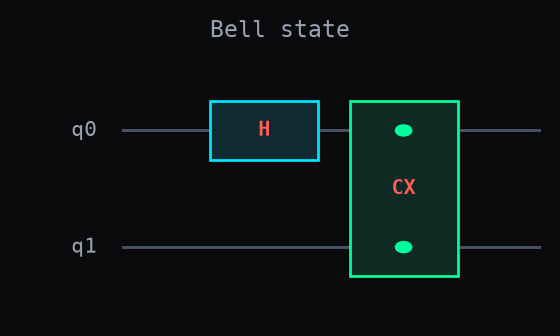

# Diagram (Quirk-style box diagrams)

A gate-tuple list like `[('h', 0), ('cx', 0, 1)]` is exact but not easy to eyeball --
`plot_circuit` draws it as an actual figure instead, Quirk-style boxes on a per-qubit
wire.

## Step 1. Draw a real circuit

```python
import dense_evolution as de

qasm = 'OPENQASM 2.0; include "qelib1.inc"; qreg q[2]; h q[0]; cx q[0],q[1];'
circuit = de.QASMParser().parse(qasm)
fig = de.plot_circuit(circuit.to_tuples(), n_qubits=2, title='Bell state')
fig.savefig('bell_circuit.png')
```



`plot_circuit(circuit, n_qubits, title=None, figsize=None)` reads the same gate-tuple
list [`Simulator`](simulator.md)'s `run_circuit_jit` runs -- integers after the gate
name are qubit indices, floats are parameters, so there's no separate gate table to
keep in sync by hand. It returns a `matplotlib.figure.Figure`, saved above with the
usual `fig.savefig(...)`. Single-qubit gates (`h`) get a cyan box; multi-qubit gates
(`cx`, spanning both wires it touches) get a green one, both boxes auto-sized to their
label.

---

## Details

**Not the same as `draw_circuit`**: [`draw_circuit`](drawing.md) is a plain-ASCII text
renderer (a printable string, not a saved figure) -- deliberately a different name
rather than an overload of this function, since the two produce genuinely different
output for different purposes.

**Provenance**: promoted from a real reproduction of arXiv:2608.16716's baseband iSWAP
pulse ([Dense-Evolution-Discovery Experiment 33](https://tatopenn-cell.github.io/Dense-Evolution-Discovery/germanium_iswap_validation/)),
where it was first used to draw the reference circuit and a single Trotterized pulse
slice.

::: dense_evolution.circuits.diagram
