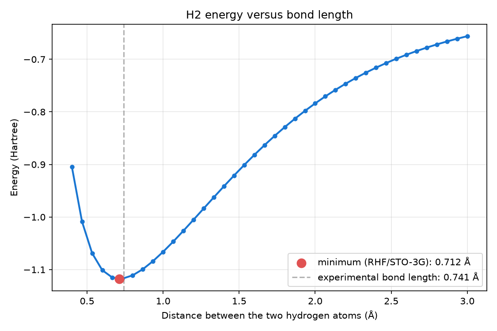

# Native Hartree-Fock

Before a molecule's electronic-structure problem can become a qubit Hamiltonian, its
integrals (overlap, kinetic, nuclear-attraction, electron-repulsion) have to be
computed and a Hartree-Fock mean-field calculation run to get a reference orbital
basis. `dense_evolution.native_hf` is a from-scratch, JAX-vectorized engine for that
step -- covers any element `basis_set_exchange` has STO-3G data for, not just the small
H-Ne table PennyLane's own bundled solver ships.

## Step 1. A real molecule's qubit Hamiltonian

```python
import numpy as np
from dense_evolution.native_hf.bridge import build_qubit_hamiltonian

geometry = np.array([[0.0, 0.0, 0.0], [0.0, 0.0, 0.7414]])
H, n_qubits, hf_result = build_qubit_hamiltonian([1, 1], geometry, n_electrons=2)

n_qubits, hf_result.converged, hf_result.n_iterations, hf_result.total_energy
```

```
(4, True, 3, -1.116684335260025)
```

`build_qubit_hamiltonian(atomic_numbers, geometry_angstrom, n_electrons)` runs the full
pipeline -- Obara-Saika integrals, then Hartree-Fock self-consistent-field iteration
(`run_scf`, DIIS-accelerated) -- for H2 (two protons, atomic number 1, `0.7414` Angstrom
apart, the real equilibrium bond length) in the default STO-3G minimal basis. It
converged in 3 iterations to a mean-field energy of `-1.1167` Ha. `H` is a `qml.Hamiltonian` -- the
converged result still goes through PennyLane's own `fermionic_observable` +
`jordan_wigner` for the qubit mapping, since that stage was already fast and
well-tested; this module only replaces the slow integral/SCF stage.

## Step 2. Hartree-Fock is a mean-field approximation -- how far off?

```python
import dense_evolution as de

coeffs, ops = H.terms()
terms = []
for coeff, op in zip(coeffs, ops):
    pauli = {}
    for factor in (op.operands if hasattr(op, 'operands') else [op]):
        if factor.name != 'Identity':
            pauli[int(factor.wires[0])] = factor.name[-1]
    terms.append((float(np.real(complex(coeff))), pauli))

H_dense = de.pauli_hamiltonian_to_matrix(terms, n_qubits)
float(np.min(np.linalg.eigvalsh(H_dense)))
```

```
-1.1372701878105904
```

Converting `H`'s Pauli terms to [`pauli_hamiltonian_to_matrix`](observables.md)'s format
and exactly diagonalizing gives `-1.1373` Ha -- lower than Step 1's Hartree-Fock energy
by about `0.02` Ha, the real electron-correlation energy Hartree-Fock's single-Slater-
determinant approximation misses entirely. At only 4 qubits, exact diagonalization is
easy; that gap is exactly what a real VQE ansatz beyond a bare Hartree-Fock reference
state is trying to close for larger, classically-intractable molecules.

## Step 3. Large mixed-basis molecules: the optional libcint bridge

```python
import numpy as np
from dense_evolution.native_hf.basis import build_molecule_shells
from dense_evolution.native_hf.assembly import build_overlap_matrix, build_core_hamiltonian
from dense_evolution.native_hf.libcint_bridge import build_repulsion_tensor_libcint
from dense_evolution.native_hf.scf import run_scf

geometry = np.array([[0.0, 0.0, 0.0]])
shells = build_molecule_shells([10], geometry, "6-31g*")
S = build_overlap_matrix(shells)
H_core = build_core_hamiltonian(shells, [10.0], geometry)
V = build_repulsion_tensor_libcint([10], geometry, "6-31g*")

result = run_scf(S, H_core, V, 10, [10.0], geometry)
result.converged, result.total_energy
```

```
(True, -128.4744065199...)
```

Step 1's molecule only needed s functions, so `build_repulsion_tensor` (the
default, pure-JAX path) was already fast. A basis mixing s, p, and d shells
-- like `6-31g*` on neon here -- costs much more with the default path: the
underlying JIT compiles one program per distinct shell-quartet shape it
meets, and a mixed basis needs dozens of them. `build_repulsion_tensor_libcint`
computes the identical tensor through
[libcint](https://github.com/sunqm/libcint) instead -- a mature C library with no per-basis compile cost at
all -- and is a drop-in replacement everywhere `build_repulsion_tensor`'s
output was used (`S` and `H_core` above still come from native_hf itself).
libcint ships inside the dense-evolution wheels for Windows, macOS and Linux,
so `pip install dense-evolution` is enough. On neon in `6-31g*` the tensor takes 0.013 s; on ethanol
(57 basis functions) 0.32 s, against 0.50 s for PySCF on the same Linux machine.

---

## Step 4. Diagnosing a stubborn SCF: energy_history

```python
from dense_evolution.native_hf.scf import diagnose_convergence

result = run_scf(S, H_core, repulsion, n_electrons, nuclear_charges, geometry_bohr)
diagnosis = diagnose_convergence(result)
print(diagnosis["anomaly_fraction_hampel"])
```

`run_scf` already computes the electronic energy at every iteration --
`HFResult.energy_history` now keeps that trace instead of throwing it
away (shape `(max_iterations,)`, `NaN` past `n_iterations`).
`diagnose_convergence` runs Dense-Armor's own Hampel filter and Tukey
fences (`dense_evolution.utility.robust_filters` -- the sister project's
anomaly detectors, validated with 0 false positives on real H2
dissociation-curve chemistry) over that trace, instead of trusting the
final `converged` flag in isolation.

**Measured, not assumed**: a real 28-heavy-atom CASMI26 fragment (this
module's own `level_shift` docstring) that fails to converge at
`level_shift=0.0` has its 200-iteration electronic-energy trace flagged
19-24% anomalous (Hampel/Tukey); the identical fragment, fixed with
`level_shift=0.5` (converges in 55 iterations), flags only ~4% --
background noise, not a false-alarm storm. Needs the `armor` extra
(`pip install dense-evolution[armor]`); `dense_armor` is not a hard
dependency of this module.

## Step 5. Energy as a function of the atoms' positions

Step 1 gives the energy of one molecule at one fixed geometry. But the
interesting questions are about *change*: how much does the energy rise
if the two atoms are pulled apart? What force does each nucleus feel?
Where is the equilibrium bond length? All of these need the energy as a
function of the atomic positions, plus its gradient.

```python
import numpy as np
from dense_evolution.native_hf.differentiable import build_energy_fn

geom = np.array([[0.0, 0.0, 0.0], [0.0, 0.0, 1.4011]])

energy_fn = build_energy_fn(
    atomic_numbers=[1, 1],
    nuclear_charges=[1.0, 1.0],
    n_electrons=2,
    basis_name="sto-3g",
    reference_geometry_bohr=geom,
)

energy_fn(geom)
```

```
-1.1166827344469228
```

`geom` is the two hydrogen atoms at the experimental bond length, in Bohr
(`1.4011` Bohr is `0.7414` Å, the geometry of Step 1; the energy matches
Step 1's up to that rounding). `build_energy_fn` returns a plain function
`geometry_bohr -> total energy in Hartree`, differentiable end-to-end with
`jax.grad`, so `jax.grad(energy_fn)` gives the force on each nucleus
directly. Here it is `±0.029` Hartree/Bohr along the bond, not zero: with
the STO-3G basis the energy minimum is slightly shorter than the
experimental bond length.



*The curve this engine produces when the two hydrogen atoms are moved apart
and the energy is computed at each distance. Pull them away and the energy
rises toward two separate atoms; push them together and it rises because
the nuclei repel each other. With RHF/STO-3G the minimum sits at `0.712` Å,
`-1.117506` Hartree; the experimental bond length is `0.741` Å. The gap is
the basis set and the mean-field approximation, not the integrals.*

---

## Details

**Why this module exists**: PennyLane's own differentiable Hartree-Fock solver
(`qml.qchem`, `method="dhf"`) builds the same integrals through a Python-level loop
wrapped in its autograd-tracing numpy layer -- correct, but profiled directly at 482 of
483 total seconds for Si2/STO-3G, almost entirely per-scalar-op tracer overhead rather
than real FLOPs. This module batches each shell-pair/quartet with `jax.lax.scan`/
`jax.vmap` and compiles with `jax.jit` instead.

**Elements beyond PennyLane's table**: basis-set parameters come from
[`basis_set_exchange`](https://github.com/MolSSI-BSE/basis_set_exchange), so any
element it has STO-3G data for is reachable -- an element needing d-orbitals or higher
(e.g. Fe) fails with a clear `NotImplementedError` naming the real limitation, not a
silent wrong energy for an incomplete basis.

**Verified against an independent implementation**: element-wise against
[lowdanie/hartree-fock-solver](https://github.com/lowdanie/hartree-fock-solver)
("slaterform", Apache-2.0, studied as a reference for structuring the Obara-Saika
recursion with `jax.lax.scan` -- no source code copied) to machine precision on
individual integrals. The original Si2/STO-3G full-SCF-energy cross-check against
slaterform predates the DIIS/Si2-convergence fix below and has not been re-run against
the corrected energy -- the per-integral cross-check is unaffected (integrals don't
depend on how the SCF loop converges), but the end-to-end Si2 number should be treated
as not yet re-verified against this independent reference. Algorithm background also
drawn from PennyLane's own white paper (Delgado et al., "Differentiable quantum
computational chemistry with PennyLane", [arXiv:2111.09967](https://arxiv.org/abs/2111.09967)).

**The libcint bridge's AO conventions**: `libcint_bridge.py` builds libcint's
`atm`/`bas`/`env` arrays from native_hf's own shells and calls the bundled library
through `ctypes`, so shells keep native_hf's order. Two differences remain inside each
shell, confirmed empirically on Ne/6-31G*: (1) Cartesian component order --
native_hf's own `cartesian_powers` uses px,pz,py and xx,xz,xy,zz,yz,yy, libcint uses
px,py,pz and xx,xy,xz,yy,yz,zz; (2) normalization -- libcint's raw d components are
not unit-self-overlap the way native_hf's are (xx/yy/zz vs. xy/xz/yz differ by exactly
a factor of 3), corrected via a rescale computed from libcint's own overlap diagonal
at call time, not a hardcoded constant. A source install has no bundled library:
build libcint and set `DENSE_EVOLUTION_LIBCINT` to the library file.

**SCF convergence (`run_scf`)**: DIIS-accelerated (Pulay 1980/1982) by default, not
plain linear damping -- see [the module's own docstring](https://github.com/tatopenn-cell/Dense-Evolution/blob/main/dense_evolution/native_hf/scf.py)
for the real Si2 near-degenerate-orbital case that motivated this (11 DIIS iterations
vs. 53 for damping alone, same converged energy to 12 significant figures) and requires
both density and energy to stop changing before declaring convergence, not density
alone.

**Level shifting for harder near-degeneracies (`run_scf(..., level_shift=...)`)**:
DIIS alone fixes the textbook Si2 case above, but a real, harder case found via a
Dense-Evolution-Discovery experiment (a 30-heavy-atom aromatic fragment from the CASMI26
molecule-ID Kaggle competition wiring) still took 1114 iterations to converge, passing
through three wildly different intermediate energies (-622, -521, -839 Hartree) at
200/1000/5000 iterations first -- the same near-degenerate-orbital oscillation as Si2,
just harder to escape. `level_shift` (Saunders & Hillier, "A `level shifting' method for
converging closed shell Hartree-Fock wave functions", Int. J. Quantum Chem. 7, 699-705
(1973)) pushes the previous iteration's virtual orbitals up in energy before each
diagonalization, opening a numerical gap that stops the occupied/virtual split from
flip-flopping. On that same fragment, `level_shift=0.5` converges in 60 iterations and
`level_shift=1.0` in 83 -- both to the identical energy (-838.928114 Hartree, matching
the unshifted 1114-iteration result to full precision) -- while `level_shift=0.1` was too
weak to help within 200 iterations. Default is `0.0` (off, backward compatible): the
transform is an exact algebraic no-op at zero shift, verified both algebraically and
numerically (H2/STO-3G gives the identical converged energy at `level_shift` in
`{0.0, 0.5, 2.0}`).

**AO-to-MO integral transformation**: `bridge._ao_to_mo`'s 4-index `einsum` +
`swapaxes` (converting AO-basis integrals to the molecular-orbital basis, using the
converged Hartree-Fock coefficients) is exactly the kind of operation where an
index-ordering mistake can produce a plausible-looking but numerically wrong
Hamiltonian -- cross-checked against two independent references: a sequential
one-index-at-a-time transform (a different algorithm computing the same quantity, not
a copy of the code under test) to `1e-10`, and a real physical invariant on H2 (a
basis change alone cannot alter the total electronic energy) to `1e-10`.

**How `build_energy_fn`'s gradient stays differentiable.** Two pieces are
deliberately frozen:

1. **Schwarz screening** — which shell quartets contribute to the ERI sum
   at all — is decided once, from the reference geometry, via
   `assembly.quartet_screening_indices`. It is a discrete decision: Python
   control flow, not a smooth function of position, and cannot be part of
   a `jax.grad` trace. Every call of the returned function reuses the same
   frozen index list.

2. **The SCF loop's gradient is analytic**, from the Pople-Krishnan-
   Schlegel-Binkley Hartree-Fock gradient (Int. J. Quantum Chem. Symp. 13,
   225 (1979), Eq. 21-22), rather than reverse-mode differentiation
   through `jax.lax.while_loop`, which JAX does not support in reverse mode.

**Where the reference geometry stops being valid.** If the nuclei move far
enough that a previously negligible shell-pair interaction becomes
non-negligible (or vice versa), the frozen screening list is stale and
`build_energy_fn` should be called again at the new geometry.

**The `W` matrix and the factor of 2.** `scf_electronic_energy`'s backward
pass builds the energy-weighted density matrix as
`W = C_occ @ diag(2 * orbital_energies_occ) @ C_occ.T`. The factor of 2 is
this module's own `P` convention, not part of Pople et al.'s original
spin-orbital formula — there is no explicit 2 in `P` itself, it is carried
instead by `F = H_core + 2J - K`. Omitting the factor gave a gradient that
disagreed with central finite differences by exactly `Tr[W dS/dx]`.

**Verified against finite differences.** The custom VJP is checked against
central finite differences on H2/STO-3G in
`tests/unit/test_native_hf_differentiable.py`.

**Where this is used in practice.** [`dense_evolution.qmmm`](qmmm.md)'s
ASE bridge (`DenseEvolutionCalculator`) calls this function, exposing it to
ASE's optimizers and MD drivers.

**ERI cost on mixed s/p/d bases**: `assembly.py`'s electron-repulsion tensor
compiles one `jax.jit` program per distinct shell-quartet shape it
encounters. A minimal s/p basis needs only a handful; a basis mixing s, p,
and d shells (e.g. 6-31G*) needs dozens, because the compile cache keys on
primitive count per shell too, not just angular-momentum degree. Profiling
(Ne/6-31G*) found compile overhead alone accounted for effectively all of a
single run's wall time, warm execution next to none -- `assembly.py` now
pads every shell's primitive count up to the molecule-wide max (a repeated
exponent with coefficient 0, contributing exactly zero to the sum) so
shells of the same degree share one compiled program regardless of how many
primitives they actually have. See `prog.txt` for the full measurement,
including two other approaches (a persistent compilation cache, parallel
compilation across processes) that were tried and abandoned.

**Production entry point**: [`dashboard_core.hamiltonians`](dashboard_core_hamiltonians.md)
calls this engine automatically (`bridge.build_qubit_hamiltonian`) whenever a requested
molecule uses an element outside PennyLane's own STO-3G table -- existing catalog
molecules (H2/HeH+/H3+/LiH/H2O) are unaffected and keep using PennyLane's `dhf`
pipeline directly. See that page for the dispatch logic and the Si2 catalog entry this
engine backs, and [`dashboard_core.vqe`](dashboard_core_vqe.md) for ansatz circuits
optimized against Hamiltonians built this way.

::: dense_evolution.native_hf.bridge

::: dense_evolution.native_hf.scf

::: dense_evolution.native_hf.basis

::: dense_evolution.native_hf.libcint_bridge

::: dense_evolution.native_hf.differentiable

::: dense_evolution.native_hf.gaussians

::: dense_evolution.native_hf.boys

::: dense_evolution.native_hf.overlap

::: dense_evolution.native_hf.cartesian

::: dense_evolution.native_hf.kinetic

::: dense_evolution.native_hf.coulomb

::: dense_evolution.native_hf.assembly
