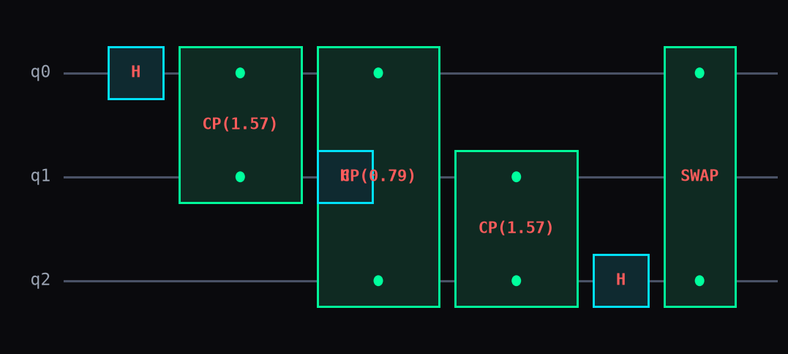

# QFT (Quantum Fourier Transform)

The Quantum Fourier Transform maps each computational basis state to a superposition
where the relative phases between amplitudes encode a frequency -- the same role the
classical discrete Fourier transform plays, just done on qubit amplitudes with a
circuit of `H` and controlled-phase gates instead of a sum over samples. It's the
building block behind phase estimation, Shor's algorithm, and any circuit that needs
to read out a periodicity encoded in a state.

## Step 1. QFT of the all-zero state: no phase yet

```python
import numpy as np
import dense_evolution as de

sim = de.DenseSVSimulator(2)
sim.run_circuit(de.qft(2))
print(np.round(sim.get_statevector(), 4))
print(np.round(sim.get_probabilities(), 4))
```

```
[0.5+0.j 0.5+0.j 0.5+0.j 0.5+0.j]
[0.25 0.25 0.25 0.25]
```

`de.qft(2)` returns a plain gate-tuple list -- an `H`/controlled-phase cascade plus a
trailing swap -- ready for `run_circuit` exactly like any hand-built circuit. Starting
from `|00>`, every output amplitude is real and equal: `|00>` carries no frequency
information for the transform to reveal, so this looks identical to plain `H` on every
qubit. The interesting part only shows up once the input isn't `|00>`.

## Step 2. QFT of `|01>`: now the phases move

```python
sim2 = de.DenseSVSimulator(2)
sim2.run_circuit([('x', 1)] + de.qft(2))
print(np.round(sim2.get_statevector(), 4))
print(np.round(sim2.get_probabilities(), 4))
```

```
[ 0.5+0.j   0. +0.5j -0.5+0.j  -0. -0.5j]
[0.25 0.25 0.25 0.25]
```

`('x', 1)` flips qubit 1 first, so the QFT now runs on `|01>` instead of `|00>`. The
probabilities are still uniform -- QFT is unitary, so it never changes how much
amplitude is on each basis state, only its phase -- but the phases are now
`1, i, -1, -i`: successive powers of `i`, exactly `e^(2*pi*i*k/4)` for `k = 0,1,2,3`.
That rotating phase pattern *is* the Fourier transform of `|01>` -- it's what phase
estimation and Shor's algorithm read out downstream.



The diagram above is `de.plot_circuit(de.qft(3), 3)` -- the real 3-qubit cascade:
`H` on each qubit, a controlled-phase gate back to every qubit already processed, and
the trailing swap pair that reorders the output to match the input's qubit order.

## Step 3. Undo it: QFT then inverse QFT

```python
sim3 = de.DenseSVSimulator(2)
sim3.run_circuit([('x', 1)] + de.qft(2) + de.qft(2, inverse=True))
print(np.round(sim3.get_statevector(), 4))
```

```
[0.+0.j 1.+0.j 0.+0.j 0.+0.j]
```

`de.qft(2, inverse=True)` builds the same gate set in reverse order with negated
phase angles -- applying it right after the forward transform exactly undoes it,
landing back on `|01>` (amplitude `1` at index `1`) with no rounding drift beyond
what's printed here.

---

## Details

**`do_swaps=False`** skips the trailing qubit-reversal swap. The `H`/controlled-phase
cascade alone produces the transformed amplitudes in bit-reversed qubit order; leave
`do_swaps` at its default `True` unless you're chaining directly into a subroutine
that already expects that reversal (skipping the swaps there is a real speedup, since
`swap` is itself three `cx` gates).

**Verified against the analytic DFT matrix**: `qft(n)`'s output matches a brute-force
`numpy` discrete Fourier transform matrix to within `1.4e-15` across 1-4 qubits, and a
forward-then-inverse round trip returns the exact input to numerical precision (Step 3
above is that same check, done by hand).

**See also**: [States](states.md) and [Topology](topology.md) are the other two
gate-tuple-list circuit builders in this package -- `ghz_state` and
`entangling_layer` -- for building the rest of a circuit around a QFT block.

::: dense_evolution.circuits.qft
