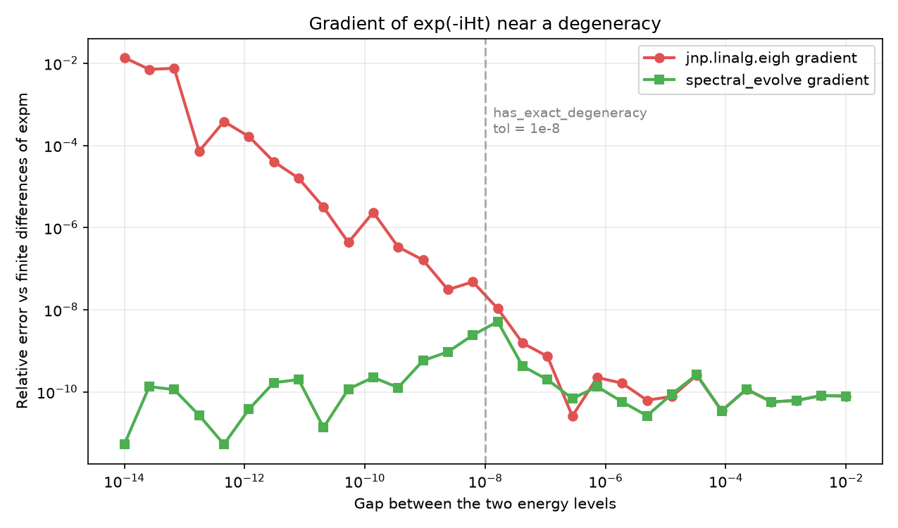

# Spectral (`exp(-iHt)`, and other functions of a matrix)

A quantum system with Hamiltonian `H`, left alone for a time `t`, evolves
into the state `exp(-iHt)`. Any other smooth function of `H` -- `sqrt(H)`,
`log(H)`, a step function -- works the same way: diagonalize `H`, apply the
function to each energy, rotate back. `dense_evolution.physics.spectral`
does that, with one specific fix.

The fix matters because of a trap you can fall into without noticing. The
gradient of `exp(-iHt)` with respect to `H` -- the thing you need if you
want to *learn* or *optimize* `H` -- is computed wrongly by the standard
method when two of `H`'s energies are exactly equal. Nothing crashes. The
number just comes back silently wrong.



*The x-axis is the gap between two energies of a random 4×4 Hamiltonian:
`1e-14` on the left means they are almost identical, `1e-2` on the right
means they are well separated. Each curve is the relative error of a
gradient of `exp(-iHt)` against central finite differences of
`jax.scipy.linalg.expm`. Red is the standard `jnp.linalg.eigh` gradient,
green is `spectral_evolve`. Well separated, both sit at the `1e-10` level
of the finite-difference reference. As the gap closes the red error climbs
to `1e-2`; the green one stays below `1e-8` everywhere.*

## Step 1. Recognize when you have a degenerate Hamiltonian

Two energies are **degenerate** when they are exactly equal -- two different
states of the system happen to share the same energy. That is not a
pathology: it happens in every symmetric molecule and every lattice model.
Here is how to check for it:

```python
import jax.numpy as jnp
from dense_evolution.physics import has_exact_degeneracy

H_deg = jnp.diag(jnp.array([1.0, 1.0, 2.0, 2.0]))
H_gap = jnp.diag(jnp.array([1.0, 1.001, 2.0, 2.001]))

has_exact_degeneracy(H_deg), has_exact_degeneracy(H_gap)
```

```
(True, False)
```

`has_exact_degeneracy(H)` answers a single question: are any two of `H`'s
eigenvalues closer together than `1e-8`? `H_deg` has two pairs of exactly
equal energies, so it returns `True`. `H_gap` looks identical on paper, but
its smallest gap is `0.001` -- far above the threshold -- so it returns
`False`.

This is a check, not a fix. Run it once before you decide which method to
use for the gradient.

## Step 2. Evolve a system forward in time

Now the actual evolution. `spectral_evolve(H, t)` gives you `exp(-iHt)` as
a matrix, and it is safe to differentiate at any gap:

```python
import jax
import jax.numpy as jnp
from dense_evolution.physics import spectral_evolve

H = jnp.diag(jnp.array([1.0, 1.0, 2.0, 2.0], dtype=jnp.complex128))

def loss(H_):
    return jnp.real(jnp.sum(spectral_evolve(H_, t=1.0)))

jax.grad(loss)(H)
```

```
[[-0.841-0.540j -0.841-0.540j -0.956-0.068j -0.956-0.068j]
 [-0.841-0.540j -0.841-0.540j -0.956-0.068j -0.956-0.068j]
 [-0.956-0.068j -0.956-0.068j -0.909+0.416j -0.909+0.416j]
 [-0.956-0.068j -0.956-0.068j -0.909+0.416j -0.909+0.416j]]
```

Forward, `spectral_evolve(H, t)` is the same matrix you would get from
`v @ diag(exp(-1j*w*t)) @ v.conj().T` -- identical to machine precision.
The difference is entirely on the backward pass, where the gradient with
respect to `H` is built with a formula that stays correct at exact
degeneracy (Step 4 shows which).

`loss(H_)` reduces `exp(-iHt)` to a single real number, so `jax.grad` can
differentiate it. The result is a complex matrix of the same shape as `H`.
The output has a visible block structure -- rows and columns `0, 1` share
one value, and so do `2, 3` -- because those are the pairs of exactly
equal energies. The gradient respects the degeneracy: it does not try to
pick one basis state over the other inside a degenerate pair.

## Step 3. Any function of `H`, not just the exponential

If the function you need is not `exp(-iHt)`, use `matrix_function_eigh`
directly. It takes `H`, plus the function `f` you want to apply to the
eigenvalues, plus its derivative `f_prime`:

```python
import jax.numpy as jnp
from dense_evolution.physics import matrix_function_eigh

H = jnp.diag(jnp.array([1.0, 1.0, 4.0, 4.0], dtype=jnp.complex128))

U = matrix_function_eigh(
    H,
    f       = lambda w: jnp.sqrt(w),
    f_prime = lambda w: 0.5 / jnp.sqrt(w),
)
U
```

```
[[1.+0.j 0.+0.j 0.+0.j 0.+0.j]
 [0.+0.j 1.+0.j 0.+0.j 0.+0.j]
 [0.+0.j 0.+0.j 2.+0.j 0.+0.j]
 [0.+0.j 0.+0.j 0.+0.j 2.+0.j]]
```

`H` has eigenvalues `[1, 1, 4, 4]`. `f` is `sqrt`, so the output is the
diagonal matrix with `sqrt` applied to each energy: `[1, 1, 2, 2]`.
`f_prime` is only consulted where two eigenvalues are exactly equal, as the
limit of the divided difference in Step 4 -- away from a tie, the
non-degenerate entries use the divided difference, not `f_prime`'s value.

Both callables must return complex values if `H` is complex. Neither should
be a closure over a JAX array: they are treated as static by JAX, so a
captured array will not be traced through.

`spectral_evolve` from Step 2 is a one-line wrapper around this function,
with `f` and `f_prime` filled in for the exponential.

## Step 4. The formula behind the gradient

The gradient rule is the classical divided-difference formula for a matrix
function's derivative (Kato 1995, Ch. II.5.6). For a perturbation `dH` of
`H`:

```
d/deps [ exp(-i H(eps) t) ]  =  V (F o (V^dagger dH V)) V^dagger
```

with `F` the matrix of divided differences of the exponential:

```
F[i,j] = (exp(-i lambda_i t) - exp(-i lambda_j t)) / (lambda_i - lambda_j)   if lambda_i != lambda_j
F[i,j] = -i t exp(-i lambda_i t)                                              if lambda_i == lambda_j
```

The key detail is what is *not* in that formula: the eigenvectors `V` are
consumed only through the projected matrix `V^dagger dH V`, never carried
through as a differentiable output. At exact degeneracy the eigenvectors
are not unique -- any orthonormal basis of the degenerate subspace works
equally well, and `jnp.linalg.eigh` picks one arbitrarily. Differentiating
through that choice is what makes the standard method wrong. By not
depending on it, this formula stays correct.

---

## Details

**The actual failure mode.** `jnp.linalg.eigh`'s reverse-mode rule divides
by `lambda_i - lambda_j` for every eigenvector pair. At an exact tie that
is `0/0`; JAX does not raise, it returns a finite but wrong number.
Measured on a Kaggle CPU kernel (Dense-Evolution-Discovery, PR #173):
standard `eigh` gradient error `0.98` versus Kato `4e-10` on an `H` with
four exact doubly-degenerate eigenvalues -- several orders of magnitude,
not a rounding difference. The plot at the top of this page measures the same
effect across the gap range (random 4×4 Hamiltonian, seed 0, gaps `1e-14`
to `1e-2`, finite-difference step `1e-6`).

**When to use which method.**

| Situation | Method |
|---|---|
| `H` has an exact degeneracy (gap below `1e-8`) | `spectral_evolve` / `matrix_function_eigh` |
| `H` has only near-degeneracy (smallest gap above `1e-8`) | plain `jnp.linalg.eigh` |
| Forward value only, no gradient needed | plain `jnp.linalg.eigh` |

Above the threshold, `spectral_evolve` never hurts -- it just does not
help. The check from Step 1 is what makes the decision cheap.

**References.** Kato, T., *Perturbation Theory for Linear Operators*,
Springer (1995), Ch. II.5.6 -- the classical divided-difference formula for
matrix-function derivatives, which predates the modern quantum-chemistry
literature by decades. Kasim, M. F., arXiv:2011.04366 (2020) -- the same
formula stated specifically for degenerate Hermitian matrices, in a form
more directly applicable to this code. Both were checked against the
actual paper text, not trusted from a citation string alone.

**Why `custom_jvp` rather than `custom_vjp`.** The formula needs only
`(H, dH, w, v)` at the primal point, with no compatibility condition on
the perturbation direction. A VJP built on top of `eigh`'s own eigenvector
output would need one (Kasim's Eq. 4.72, confirmed present in the actual
paper text). This is a structural property of the formula, not an
implementation preference.

**Hermitian only.** The module uses `eigh`, not `eig`. `f` and `f_prime`
must return complex values when `f` is complex. `f_prime` is only ever
consulted at `lambda_i == lambda_j`; the non-degenerate entries use the
divided difference, not its value, so it does not need to be accurate
away from the diagonal.

**Standalone precision.** Both `matrix_function_eigh` and
`has_exact_degeneracy` call `dense_evolution.config.ensure_x64()` on
entry, so a fresh process that reaches for them first does not stay at
JAX's `float32` default.

**Regression test.** `tests/unit/test_spectral.py` includes a guard test,
`test_std_eigh_fails_at_degeneracy`, that asserts the standard `eigh`
gradient *is* wrong at degeneracy. If a future JAX release fixes this
upstream, that test fails loudly -- the signal to retire `spectral_evolve`,
not a silent pass.

::: dense_evolution.physics.spectral

---

**See also**: [Autodiff](autodiff.md) -- the differentiable-VQE pipeline
where an `H` with exact degeneracy would otherwise produce a silently
wrong parameter update. [Observables](observables.md) -- the Pauli-sum
Hamiltonian format an `H` on this page would typically be built from.
```

