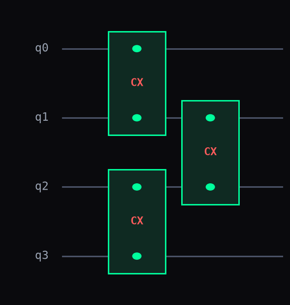

# Topology (entangling-layer patterns)

Every variational circuit (VQE, QAOA, hardware-efficient ansätze) needs an entangling
layer -- a set of two-qubit gates connecting qubits in some pattern -- and hand-writing
it as a `for` loop is one of the most repeated patterns in quantum-circuit code.
`entangling_layer` gives five of the standard patterns a name and a single call
instead, the same role Qiskit's `TwoLocal(entanglement=...)` or PennyLane's
`qml.broadcast(pattern=...)` play.

## Step 1. The five patterns, on 4 qubits

```python
from dense_evolution.circuits.topology import entangling_layer

for pattern in ('linear', 'circular', 'full', 'star', 'brick'):
    print(pattern, entangling_layer(4, pattern=pattern))
```

```
linear [('cx', 0, 1), ('cx', 1, 2), ('cx', 2, 3)]
circular [('cx', 0, 1), ('cx', 1, 2), ('cx', 2, 3), ('cx', 3, 0)]
full [('cx', 0, 1), ('cx', 0, 2), ('cx', 0, 3), ('cx', 1, 2), ('cx', 1, 3), ('cx', 2, 3)]
star [('cx', 0, 1), ('cx', 0, 2), ('cx', 0, 3)]
brick [('cx', 0, 1), ('cx', 2, 3), ('cx', 1, 2)]
```

Each call returns a plain gate-tuple list, ready for `run_circuit` like any hand-built
circuit. `linear` is a chain, `circular` adds one wraparound edge closing it into a
ring, `full` connects every pair (the most expressive, and the most gates), `star`
routes everything through one hub qubit, and `brick` alternates even/odd pairs into
the staircase pattern behind most Trotterized and hardware-efficient ansätze.



The diagram above is the real `brick` pattern from Step 1, drawn with
`de.plot_circuit(entangling_layer(4, pattern='brick'), 4)` -- `(0,1)` and `(2,3)` fire
in the same layer, then `(1,2)` bridges them in the next.

## Step 2. Use one as an ansatz layer

```python
import numpy as np
import dense_evolution as de
from dense_evolution.circuits.topology import entangling_layer

sim = de.DenseSVSimulator(4)
ops = [('h', i) for i in range(4)] + entangling_layer(4, pattern='brick')
sim.run_circuit(ops)
print(round(float(np.sum(sim.get_probabilities())), 6))
```

```
1.0
```

`entangling_layer`'s output concatenates directly onto any other gate list -- here, a
layer of `H` on every qubit (the usual first layer of a hardware-efficient ansatz)
followed by one `brick` entangling layer. The probabilities still sum to `1`, the same
sanity check worth running on any new ansatz layer before trusting energies computed
from it in a real [VQE](autodiff.md) loop.

---

## Details

**`gate` parameter**: any two-qubit gate name works (`'cx'`, `'cz'`, `'cy'`, or a
custom name registered elsewhere) -- it's not validated against
`dense_evolution.gates.GATES` here, so an unregistered name only fails later, at
`run_circuit` time.

**`reverse=True`** swaps `(control, target)` to `(target, control)` on every edge in
the pattern -- some ansätze alternate direction layer to layer for symmetry.

**`hub` parameter** only affects `pattern='star'`: it picks which qubit every other
qubit connects to (default `0`).

**This package's `DenseSVSimulator` has no notion of hardware connectivity at all** --
any two qubits can always interact directly, regardless of index distance. These five
patterns are an ansatz-design convenience (fewer parameters, known symmetry), not a
constraint the simulator enforces the way a real superconducting chip's physical
layout would.

**See also**: [States](states.md) -- `ghz_state` builds its `cx` chain with
`entangling_layer(pattern='linear')` directly, the simplest possible use of this
module.

::: dense_evolution.circuits.topology
