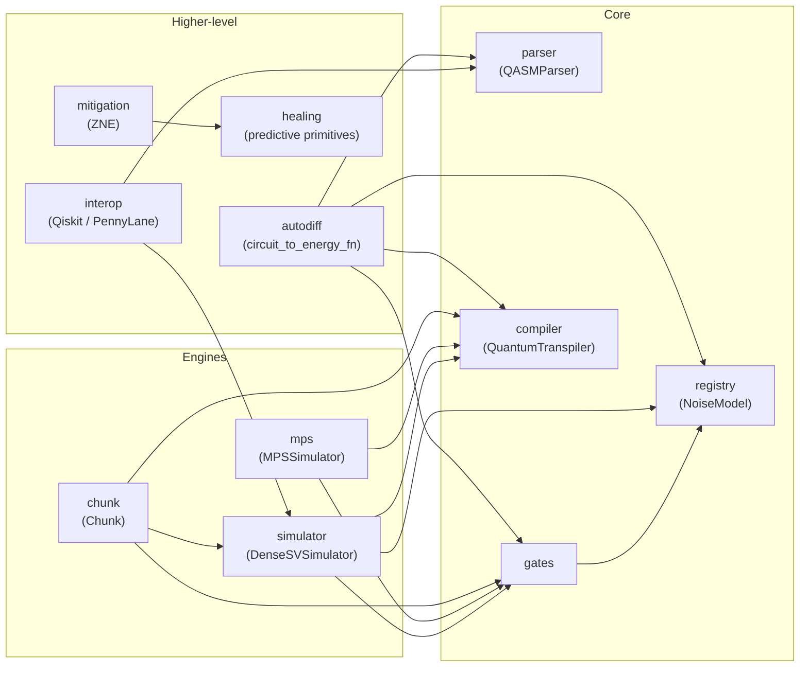

# Dense-Evolution

**Dense statevector quantum simulator · JAX XLA · NISQ · VQE · QML**

Dense-Evolution is a high-performance statevector simulator for deep NISQ circuits, VQE
pipelines, and QML workloads. It eliminates Kronecker-product overhead via stride-sliced
linear kernel fusion compiled through JAX XLA, keeping memory at the theoretical minimum
of `2ⁿ × 16 bytes`.

Using this in academic work? See [CITATION.cff](https://github.com/tatopenn-cell/Dense-Evolution/blob/main/CITATION.cff) in the repository root for citation metadata (no DOI yet -- the project isn't archived on Zenodo).

## What's in here

- **[`DenseSVSimulator`](api/simulator.md)** — the core dense statevector engine, JIT-fused
  circuit execution, projective measurement.
- **[`MPSSimulator`](api/mps.md)** — matrix-product-state engine for low-entanglement
  circuits at hundreds of qubits, with a `jax.lax.scan`-fused execution path.
- **[`Chunk`](api/chunk.md)** — anti-OOM statevector chunking for circuits too large for a
  single dense allocation, including a real multi-device distributed dispatch path.
- **[`QASMParser`](api/parser.md)** — OpenQASM 2.0 / 3.0 parsing, including `for` loops,
  range syntax, and QASM3 classical `bit` registers.
- **[`dense_evolution.mitigation`](api/mitigation.md)** — Zero-Noise Extrapolation, both the
  classic scalar/vector form and a density-matrix extension (Smolin-Gambetta-Smith physical
  projection, Uhlmann fidelity), every entry point with a `jax.jit`-compatible variant.
- **[`dense_evolution.healing`](api/healing.md)** — the predictive-healing primitives
  (`calculate_delta_preemp`, `calculate_vettore_dinamico`, ...) ZNE's healing-adapted branch
  is built on, and that `dashboard_core.run_vector_healing` / `dense_evolution_vector_healing`
  (below) apply to real noisy vector sequences.
- **[`NoiseModel`](api/registry.md)** — Kraus-channel noise (depolarizing, bitflip,
  phaseflip, amplitude damping, and a combined worst-case model), JAX- and NumPy-native.
- **Interop** with [Qiskit and PennyLane](api/interop.md), and [autodiff](api/autodiff.md)
  through `circuit_to_energy_fn` for gradient-based VQE.

## Beyond the library: Composer and MCP

Two ways to drive the simulator without writing Python against it directly, both backed by
the same local kernel (`local_site/app/server.py`, real `DenseSVSimulator`/PennyLane
Hartree-Fock, no mocked physics):

- **[Composer](composer.md)** — a browser UI: build a circuit graphically or in OpenQASM,
  compute molecular ground-state energies, run VQE, get QM/MM forces and MD trajectories,
  apply ZNE mitigation, and run the traversable-wormhole-inspired teleportation protocol.
- **[MCP Server](mcp.md)** — the same kernel, driven by an MCP-aware agent (Claude Code,
  Claude Desktop, ...) instead of a browser: 21 tools covering everything Composer does,
  plus a batch energy scan, a batch wormhole sweep, and healing a noisy vector sequence
  (`dense_evolution_vector_healing`, see `dense_evolution.healing` above).

## Module dependencies

Real module graph, traced from the actual `import` statements in each file (not an
idealized layering) -- circuit sources feed three interchangeable execution engines, which
in turn feed the higher-level mitigation/autodiff layers.

## Where to start

New to the package? Start with **[Getting Started](getting-started.md)**.

Looking for a specific function or class? Jump straight to the **[API
Reference](api/index.md)**.

Want to see what changed recently? Check the **[Changelog](changelog.md)**.

## Honesty as a design principle

This library's docstrings and changelog document real, measured findings — including
negative results and rejected approaches — not just the features that worked. Where a
number is quoted (a speedup, a fidelity improvement, a coverage percentage), it was
measured directly and the measurement is described, not assumed. See the
[Changelog](changelog.md) for the full history.
